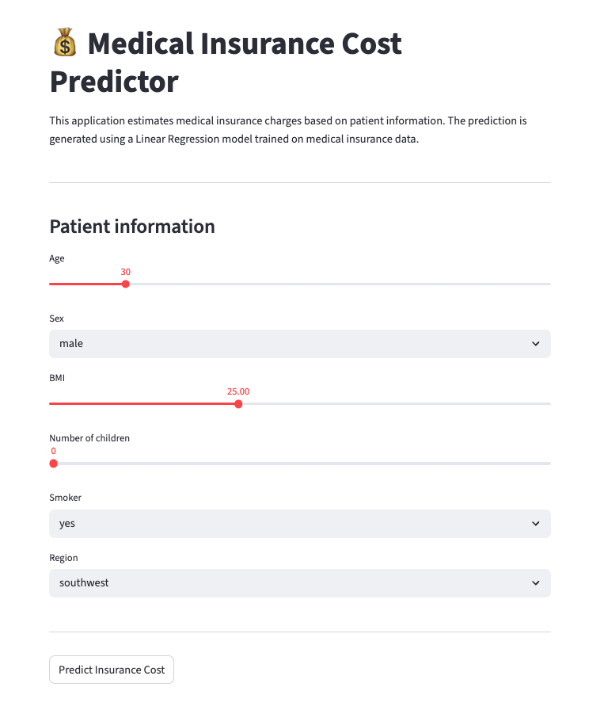

# Medical Insurance Cost Predictor

Machine Learning web application built with Streamlit and deployed on Render to estimate medical insurance costs based on customer information.

---

## Live Demo

Try the deployed application here:

https://streamlit-ml-web-app.onrender.com

## Application Preview



---

## Overview

This project transforms a Machine Learning regression model into an interactive web application that allows users to estimate medical insurance charges based on demographic and lifestyle factors.

The application was developed using Streamlit and deployed online, making the model accessible to non-technical users through a simple and intuitive interface.

---

## Business Problem

Medical insurance costs are influenced by multiple factors such as age, body mass index, smoking habits and family size.

The objective of this project is to provide an estimation tool that predicts insurance charges using historical customer data and Machine Learning techniques.

Potential use cases include:

- Insurance cost estimation.
- Risk assessment support.
- Educational demonstration of regression models.
- Machine Learning model deployment practice.

---

## Dataset

The project uses the **Medical Insurance Cost Dataset**, which contains demographic and health-related information for insurance customers.

### Features

- Age
- Sex
- BMI (Body Mass Index)
- Number of children
- Smoking status
- Region

### Target Variable

- **Charges** → Medical insurance cost.

---

## Methodology

### 1. Exploratory Data Analysis (EDA)

The dataset was analyzed to understand:

- Feature distributions.
- Relationships between variables.
- Correlations with insurance costs.
- Potential outliers.

### 2. Data Preparation

Preprocessing steps included:

- Encoding categorical variables.
- Feature selection.
- Train/Test split.

### 3. Model Training

Several regression models were evaluated.

The final application uses a **Linear Regression** model trained on the medical insurance dataset.

### 4. Model Deployment

The trained model was exported as a `.sav` file and integrated into a Streamlit web application.

Users can enter their information through the interface and receive an estimated insurance cost instantly.

---

## Application Features

The user can provide:

- Age
- Sex
- BMI
- Number of children
- Smoking status
- Region

The application processes the inputs and generates an estimated insurance cost using the trained Machine Learning model.

---

## Technologies Used

- Python
- Pandas
- NumPy
- Scikit-Learn
- Joblib
- Streamlit
- Render

---

## Repository Structure

```text
streamlit-ml-web-app/

├── README.md
├── requirements.txt
├── preview.jpg
│
├── data/
│   ├── raw/
│   ├── interim/
│   └── processed/
│
├── models/
│   └── linear_regression_medical_insurance_default.sav
│
├── src/
│   ├── app.py
│   ├── explore.ipynb
│   └── utils.py
```

---

## Key Learnings

- End-to-end Machine Learning workflow.
- Regression model development.
- Feature engineering and preprocessing.
- Model serialization using Joblib.
- Building user-facing applications with Streamlit.
- Deploying Machine Learning solutions to production environments.

---

## Live Application

The application is deployed online and can be accessed through Render.

> Add the Render URL here.

---

## Preview

> Add a screenshot of the application interface here (preview.jpg).

---

## Author

**Anais Aponte**

Senior Product Owner | Agile Delivery | Data & AI

GitHub: https://github.com/anaisaponte-GitH
